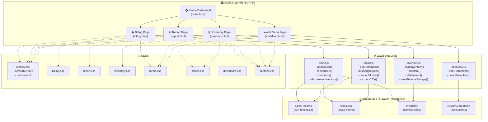
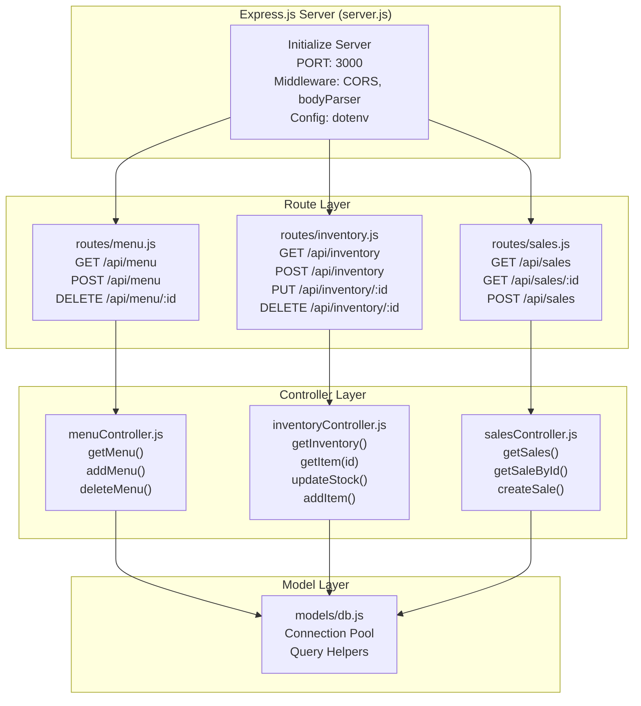
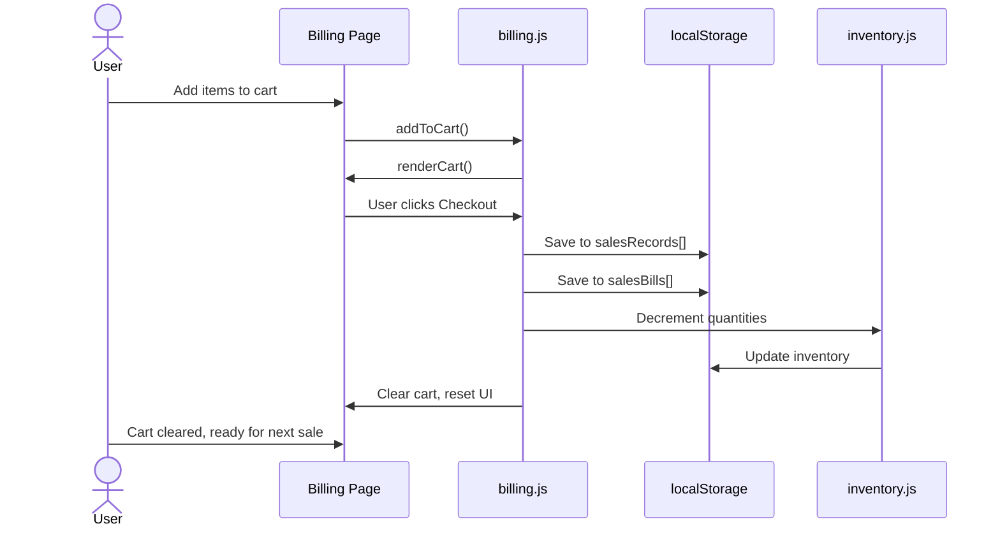
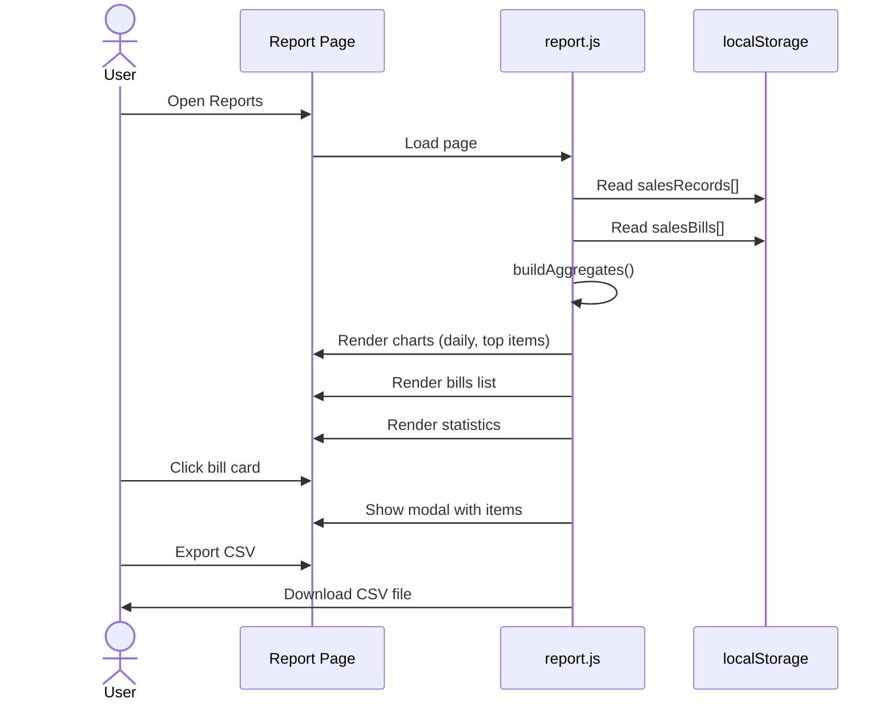
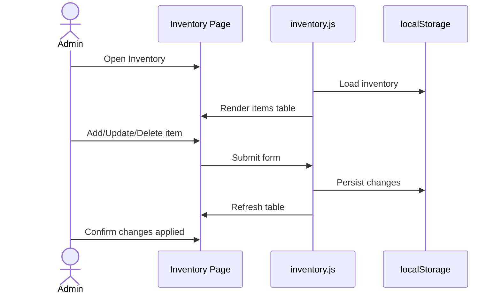
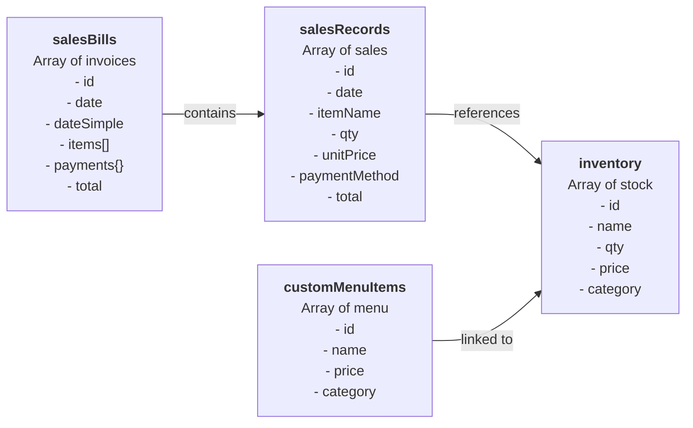

# Cafeteria Management System - Architecture & UML

## System Overview



---

## Backend Layered Architecture



---

## Updates & Current Mismatches (summary)

- The repository recently consolidated route registration into a single router file: `backend/routes/api.js`. That file mounts the API under `/api` and exposes the endpoints listed in the Routes section below.
- The `menuController` contains write handlers (`create`, `update`, `remove`) but the router currently only exposes `GET /api/menu`. If the UI needs to create/delete menu items (the frontend posts to `/api/menu`), add the POST/PUT/DELETE routes to `backend/routes/api.js` or re-add a `routes/menu.js` that is mounted by `server.js`.
- `report.js` in the frontend expects `GET /api/salesBills` and `GET /api/salesRecords`; those endpoints are implemented in `salesController` and are mounted in `routes/api.js` (so reporting endpoints exist). Earlier documentation that claimed these endpoints were missing is now outdated.
- Database connection defaults in `backend/models/db.js` include `port: 3307` and a default `DB_PASS` value in code; rely on a proper `backend/.env` (add `backend/.env.example`) to avoid surprises.
- Many frontend modules still use `localStorage` for UI convenience (for example `heldOrders`) but the canonical persistence for menu, inventory and sales is the backend database. Decide on a single source of truth (recommended: backend DB) and gradually remove full localStorage dependence for persistent data.

---

---

## Data Flow Diagram

### 1. Billing & Checkout Flow


### 2. Reports & Analytics Flow


### 3. Inventory Management Flow


---

## Data Model / localStorage Schema



---

## Component Architecture

### Frontend Pages
| Page | Purpose | Key Functions | localStorage Keys |
|------|---------|----------------|-------------------|
| **index.html** | Home/Dashboard with navigation | Navigation links to all modules | None (home page only) |
| **billing.html** | Point-of-Sale cart & checkout | `addToCart()`, `checkout()`, `decreaseQty()`, `holdOrder()` | `salesRecords`, `salesBills`, `inventory` |
| **report.html** | Analytics, bill details, CSV export | `buildAggregates()`, `renderBillsList()`, `openBillModal()`, `exportCSV()` | `salesRecords`, `salesBills` |
| **inventory.html** | Stock management CRUD | `loadInventory()`, `addItem()`, `deleteItem()`, `updateItem()` | `inventory` |
| **addMenu.html** | Custom menu item management | `addCustomItem()`, `deleteMenuItem()` | `customMenuItems` |

### JavaScript Modules

#### `billing.js`
- **Purpose:** Manages cart, checkout, and sale persistence
- **Key Functions:**
  - `addToCart(item)` — Add item to cart
  - `removeFromCart(index)` — Remove item from cart
  - `checkout()` — Process sale, persist to localStorage, decrement inventory
  - `holdOrder()` — Save partial order
  - `decrementInventory()` — Update stock after sale

#### `report.js`
- **Purpose:** Load sales data, generate analytics, render bills UI
- **Key Functions:**
  - `getStoredSales()` — Read `salesRecords` from localStorage
  - `getStoredBills()` — Read `salesBills` from localStorage
  - `buildAggregatesFromItems()` — Compute daily totals, top items
  - `calculateTotals()` — Compute stats (total revenue, orders, avg sale)
  - `renderBillsList(bills)` — Render bill cards
  - `openBillModal(billId)` — Show bill details modal
  - `filterBills()` — Filter by date/payment method
  - `exportCSV()` — Export bills to CSV file

#### `inventory.js`
- **Purpose:** Manage inventory CRUD and persistence
- **Key Functions:**
  - `loadInventory()` — Load from localStorage or initialize defaults
  - `addItem(itemObj)` — Add new inventory item
  - `updateItem(id, updates)` — Modify existing item
  - `deleteItem(id)` — Remove inventory item
  - `saveInventoryToLocalStorage()` — Persist to localStorage

#### `addMenu.js`
- **Purpose:** Manage custom menu items
- **Key Functions:**
  - `addCustomItem()` — Add custom item to menu
  - `deleteMenuItem(id)` — Remove custom menu item

### CSS Structure
| File | Purpose |
|------|---------|
| `utilities.css` | Utility classes (`.scrollable-card`, `.actions-col`) |
| `billing.css` | Billing page styling |
| `report.css` | Report page & charts styling |
| `inventory.css` | Inventory page table styling |
| `forms.css` | Form inputs & modals |
| `tables.css` | Data table styling |
| `buttons.css` | Button components |
| `dashboard.css` | General layout & dashboard |

### Backend Modules (Express.js)

#### `server.js`
- **Purpose:** Initialize Express server, middleware, routes
- **Features:**
  - CORS enabled for cross-origin requests
  - Body parser for JSON payloads
  - dotenv for environment variables
  - Listens on PORT (default: 3000)

#### Routes (actual router: `backend/routes/api.js`)

The project uses a single API router file: `backend/routes/api.js`. The router mounts a set of endpoints under the `/api` prefix. Current mounted endpoints are:

- `GET /api/menu` — read menu items (menuController.getAll)
- Inventory endpoints (inventoryController):
    - `GET /api/inventory`
    - `POST /api/inventory`
    - `PUT /api/inventory/:id`
    - `DELETE /api/inventory/:id`
- Sales / reporting endpoints (salesController):
    - `GET /api/sales` — raw sales records
    - `POST /api/sales` — create a sale (stores items in `items_json`)
    - `GET /api/salesRecords` — flattened per-item records for reporting
    - `GET /api/salesBills` — invoice-level bills for reporting

Note: Although `menuController` implements `create`, `update`, and `remove` handlers, the API router currently only exposes the read endpoint for menu (`GET /api/menu`). If the frontend must support creating or deleting menu items via the API, add the corresponding POST/PUT/DELETE routes to `backend/routes/api.js` (or restore a dedicated `routes/menu.js` that is mounted by the server).

#### Controllers

**`controllers/menuController.js`**
- `getMenu()` — Retrieve all menu items
- `addMenu(itemData)` — Insert menu item
- `deleteMenu(id)` — Remove menu item

**`controllers/inventoryController.js`**
- `getInventory()` — Retrieve all stock
- `getItem(id)` — Get single item
- `updateStock(id, qty)` — Update quantity
- `addItem(itemData)` — Add new stock item

**`controllers/salesController.js`**
- `getSales()` — Retrieve all sales
- `getSaleById(id)` — Get single sale
- `createSale(saleData)` — Record new sale

#### Database

**`models/db.js`**
- Database connection pool
- Query execution helpers
- Connection management

---

## Key Features & Flows

### ✅ Sales Persistence
- When checkout completes the frontend POSTs the sale to `POST /api/sales` and the backend persists the sale in the database (table: `sales`). Each sale stores `items_json`, `total_amount`, and `payment_type`.
- The frontend still maintains short-lived UI state (held orders) in `localStorage`, but the canonical sales data is the backend DB.

### ✅ Inventory Synchronization
- Inventory is stored in the backend `inventory` table and exposed via `GET /api/inventory` and updated via `PUT /api/inventory/:id`.
- Some frontend code may update local UI or use `localStorage` for convenience, but inventory for multi-terminal correctness should be updated via the backend API. Recommended: move inventory decrement to the backend or call the inventory update API after a sale completes.

### ✅ Reports & Analytics
- Charts: Daily revenue, Top-selling items, Payment breakdown
- Detailed view: Individual bill cards with modal showing exact items
- CSV export: One row per bill with items summary
- Filters: By date range, payment method

### ✅ Menu Management
- Add custom menu items → saved to `customMenuItems` in `localStorage`
- Custom items appear in Billing page cart
- Custom items can be deleted/updated

---

## Technology Stack

| Layer | Technology |
|-------|-----------|
| **Frontend UI** | HTML5, Bootstrap 5, CSS3 |
| **Scripting** | Vanilla JavaScript (ES6) |
| **Charts** | Chart.js |
| **State Management** | browser `localStorage` (client-side persistence) |
| **Backend** | (Optional: planned for multi-terminal durability) |

---

## Recommended Next Steps

1. **Prevent Overselling:** Add inventory check at checkout to reject sales if qty > available stock
2. **Inventory ID Mapping:** Link cart items to inventory by ID instead of name matching
3. **Event Listeners:** Move inline onclick handlers to JS listeners (cleaner separation)
4. **Backend Integration:** Express.js + MongoDB/PostgreSQL for multi-terminal durability
5. **Unit Tests:** Jest/Mocha for business logic validation

---

## File Structure (Complete)

```
Cafeteria-Management-System/
├── frontend/
│   ├── pages/
│   │   ├── index.html          (Dashboard entry point)
│   │   ├── billing.html        (POS cart & checkout)
│   │   ├── report.html         (Analytics & bills)
│   │   ├── inventory.html      (Stock management)
│   │   └── addMenu.html        (Menu item management)
│   ├── js/
│   │   ├── billing.js          (Cart & checkout logic)
│   │   ├── report.js           (Analytics & reports logic)
│   │   ├── inventory.js        (Inventory CRUD)
│   │   └── addMenu.js          (Menu management)
│   └── css/
│       ├── utilities.css       (Utility classes)
│       ├── billing.css         (Billing page styles)
│       ├── report.css          (Report page styles)
│       ├── inventory.css       (Inventory page styles)
│       ├── forms.css           (Form & modal styles)
│       ├── tables.css          (Table styles)
│       ├── buttons.css         (Button components)
│       └── dashboard.css       (Layout & dashboard)
├── backend/
│   ├── server.js               (Express server entry)
│   ├── package.json            (Dependencies)
│   ├── .env                    (Environment variables)
│   ├── controllers/
│   │   ├── menuController.js   (Menu CRUD logic)
│   │   ├── inventoryController.js (Inventory logic)
│   │   └── salesController.js  (Sales logic)
│   ├── models/
│   │   └── db.js               (Database connection)
│   ├── routes/
│   │   ├── menu.js             (Menu API endpoints)
│   │   ├── inventory.js        (Inventory API endpoints)
│   │   └── sales.js            (Sales API endpoints)
│   └── node_modules/           (npm packages)
├── database/
│   └── (Empty - for future SQL scripts)
├── docs/
│   └── ARCHITECTURE.md         (This file)
└── .gitignore, README.md, etc.
```

---

## Current Implementation Status

| Component | File(s) | Status | Details |
|-----------|---------|--------|---------|
| **Frontend Pages** | 5 HTML files | ✅ Complete | index, billing, report, inventory, addMenu |
| **Frontend Logic** | 4 JS files | ✅ Complete | All modules with localStorage persistence |
| **Frontend Styles** | 8 CSS files | ✅ Complete | Responsive Bootstrap-based styling |
| **Backend Server** | server.js | ✅ Created | Express setup with CORS & middleware |
| **API Routes** | 3 route files | ✅ Created | menu, inventory, sales endpoints |
| **Controllers** | 3 controller files | ✅ Created | menuController, inventoryController, salesController |
| **Database Models** | db.js | ✅ Created | Connection pool ready |
| **Database Setup** | /database | ⏳ Pending | No SQL scripts yet |
| **Frontend-Backend Integration** | fetch() calls | ⏳ Pending | Routes created, frontend ready for API calls |

---

**Last Updated:** November 30, 2025
**Project:** Cafeteria Management System (POS)
**Architecture:** Hybrid: frontend static UI + Express API (backend implemented). Database schema present but SQL seeds pending.
