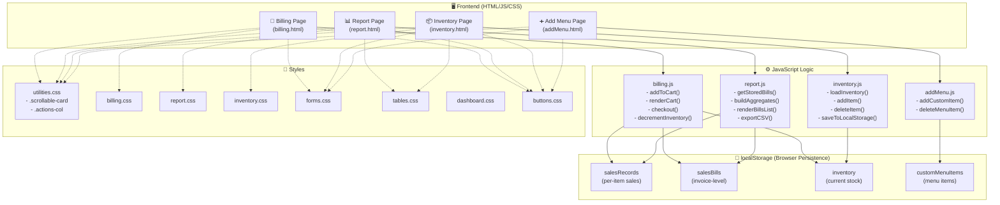
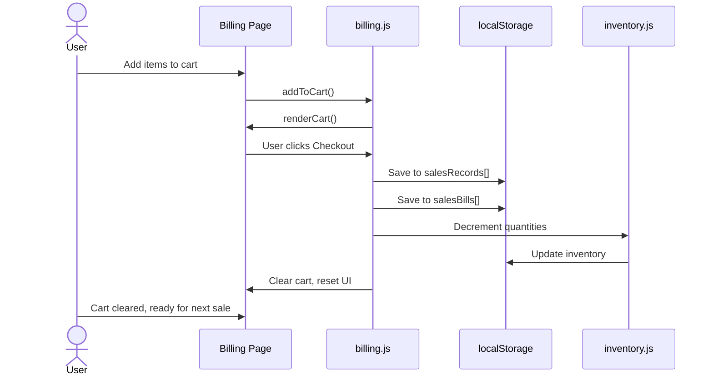
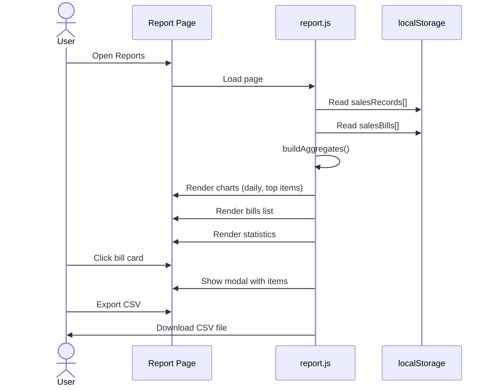
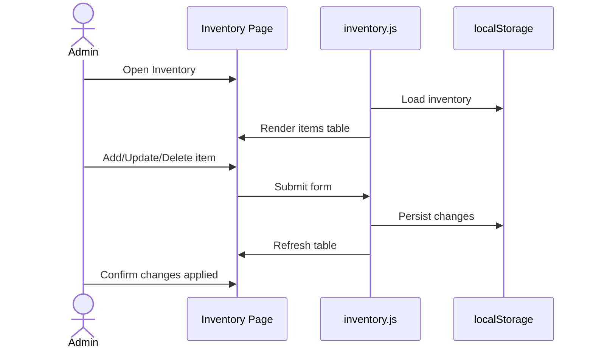
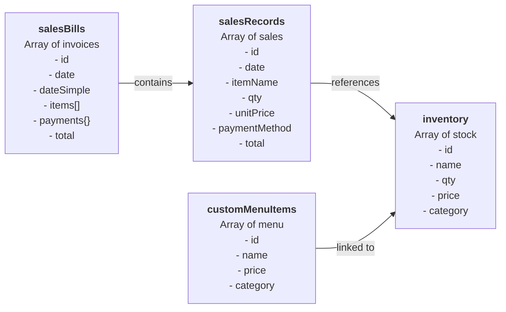

# Cafeteria Management System - Architecture & UML

## System Overview



---

## Data Flow Diagram

### 1. Billing & Checkout Flow


### 2. Reports & Analytics Flow


### 3. Inventory Management Flow


---

## Data Model / localStorage Schema



---

## Component Architecture

### Frontend Pages
| Page | Purpose | Key Functions | localStorage Keys |
|------|---------|----------------|-------------------|
| **billing.html** | Point-of-Sale cart & checkout | `addToCart()`, `checkout()`, `decreaseQty()`, `holdOrder()` | `salesRecords`, `salesBills`, `inventory` |
| **report.html** | Analytics, bill details, CSV export | `buildAggregates()`, `renderBillsList()`, `openBillModal()`, `exportCSV()` | `salesRecords`, `salesBills` |
| **inventory.html** | Stock management CRUD | `loadInventory()`, `addItem()`, `deleteItem()`, `updateItem()` | `inventory` |
| **addMenu.html** | Custom menu item management | `addCustomItem()`, `deleteMenuItem()` | `customMenuItems` |

### JavaScript Modules

#### `billing.js`
- **Purpose:** Manages cart, checkout, and sale persistence
- **Key Functions:**
  - `addToCart(item)` — Add item to cart
  - `removeFromCart(index)` — Remove item from cart
  - `checkout()` — Process sale, persist to localStorage, decrement inventory
  - `holdOrder()` — Save partial order
  - `decrementInventory()` — Update stock after sale

#### `report.js`
- **Purpose:** Load sales data, generate analytics, render bills UI
- **Key Functions:**
  - `getStoredSales()` — Read `salesRecords` from localStorage
  - `getStoredBills()` — Read `salesBills` from localStorage
  - `buildAggregatesFromItems()` — Compute daily totals, top items
  - `calculateTotals()` — Compute stats (total revenue, orders, avg sale)
  - `renderBillsList(bills)` — Render bill cards
  - `openBillModal(billId)` — Show bill details modal
  - `filterBills()` — Filter by date/payment method
  - `exportCSV()` — Export bills to CSV file

#### `inventory.js`
- **Purpose:** Manage inventory CRUD and persistence
- **Key Functions:**
  - `loadInventory()` — Load from localStorage or initialize defaults
  - `addItem(itemObj)` — Add new inventory item
  - `updateItem(id, updates)` — Modify existing item
  - `deleteItem(id)` — Remove inventory item
  - `saveInventoryToLocalStorage()` — Persist to localStorage

#### `addMenu.js`
- **Purpose:** Manage custom menu items
- **Key Functions:**
  - `addCustomItem()` — Add custom item to menu
  - `deleteMenuItem(id)` — Remove custom menu item

### CSS Structure
| File | Purpose |
|------|---------|
| `utilities.css` | Utility classes (`.scrollable-card`, `.actions-col`) |
| `billing.css` | Billing page styling |
| `report.css` | Report page & charts styling |
| `inventory.css` | Inventory page table styling |
| `forms.css` | Form inputs & modals |
| `tables.css` | Data table styling |
| `buttons.css` | Button components |
| `dashboard.css` | General layout & dashboard |

---

## Key Features & Flows

### ✅ Sales Persistence
- When checkout completes → save per-item records to `salesRecords` + invoice-level record to `salesBills`
- Both stored in browser `localStorage` for offline-first capability

### ✅ Inventory Synchronization
- Inventory loaded from `localStorage` on app startup
- On checkout, matching items decremented by quantity sold
- Updated inventory persisted back to `localStorage`

### ✅ Reports & Analytics
- Charts: Daily revenue, Top-selling items, Payment breakdown
- Detailed view: Individual bill cards with modal showing exact items
- CSV export: One row per bill with items summary
- Filters: By date range, payment method

### ✅ Menu Management
- Add custom menu items → saved to `customMenuItems` in `localStorage`
- Custom items appear in Billing page cart
- Custom items can be deleted/updated

---

## Technology Stack

| Layer | Technology |
|-------|-----------|
| **Frontend UI** | HTML5, Bootstrap 5, CSS3 |
| **Scripting** | Vanilla JavaScript (ES6) |
| **Charts** | Chart.js |
| **State Management** | browser `localStorage` (client-side persistence) |
| **Backend** | (Optional: planned for multi-terminal durability) |

---

## Recommended Next Steps

1. **Prevent Overselling:** Add inventory check at checkout to reject sales if qty > available stock
2. **Inventory ID Mapping:** Link cart items to inventory by ID instead of name matching
3. **Event Listeners:** Move inline onclick handlers to JS listeners (cleaner separation)
4. **Backend Integration:** Express.js + MongoDB/PostgreSQL for multi-terminal durability
5. **Unit Tests:** Jest/Mocha for business logic validation

---

## File Structure

```
Cafeteria-Management-System/
├── backend/
│   ├── server.js
│   ├── package.json
│   ├── controllers/
│   │   └── inventoryController.js
│   ├── models/
│   │   └── inventoryModel.js
│   └── routes/
│       └── inventory.js
├── frontend/
│   ├── pages/
│   │   ├── billing.html
│   │   ├── report.html
│   │   ├── inventory.html
│   │   └── addMenu.html
│   ├── js/
│   │   ├── billing.js
│   │   ├── report.js
│   │   ├── inventory.js
│   │   └── addMenu.js
│   └── css/
│       ├── utilities.css
│       ├── billing.css
│       ├── report.css
│       ├── inventory.css
│       ├── forms.css
│       ├── tables.css
│       ├── buttons.css
│       └── dashboard.css
├── database/
├── docs/
│   └── ARCHITECTURE.md (this file)
└── README.md
```

---

**Last Updated:** November 29, 2025
**Project:** Cafeteria Management System (POS)
